# Hoe gebruik je Jupyter Notebooks met Anaconda?

Hier wordt uitgelegt hoe je Jupyter Notebooks gebruikt in de IDE van Visual studio code en hoe je deze linkt aan een omgeving/environment van Anaconda.

  

## Inleiding 

### Wat kunnen deze programma's en waarom zou je ze gebruiken?

Met het programma Anaconda kun je omgevingen maken die je softwarepakketten kunnen beheren, zoals Python, Pip en Jupyter om er maar een paar te noemen. 

Jupyter-notebooks zijn een vorm van universeel delen van data science-concepten, waarmee je live code kunt delen.

Visual studio code kan vele soorten coderingsbestanden beheren en kan gebruikt worden als gebruikersinterface, waardoor het praktischer in het gebruik is.

           

## Inhoudsopgave

Hoofdstuk 1 basis: Begrippenlijst:

Hoofdstuk 2 basis: Download Anaconda

Hoofdstuk 3 basis: Download Visual studio code

Hoofdstuk 4 basis: Een Omgeving/environment maken 

Hoofdstuk 5 basis: De benodigde plug-ins downloaden 

Hoofdstuk 6 basis: Een Jupyter-notebookbestand maken in Visual studio code 

hoofdstuk 7 basis: Aansluiten

hoofdstuk 8 basis: Testen

Hoofdstuk 9 basis: Bekende installatieproblemen en hoe deze te debuggen 

Hoofdstuk 10 geavanceerd: Hoe kan je Powershell gebruiken als Terminal

          

## Hoofdstuk 1 basis: Begrippenlijst:

  

### je kan hier op terug kijken als je worden niet begrijpt.

  

### (Anaconda) 

Een progamma waar je paketjes kan toevoegen aan folders die jij aan maakt, deze folders kan jij vervolgens aan IDE's verbinden zoals Visual Studio code het is dan ook mogelijk om via de command prompt in Visual studio code pakketjes te downloaden in jouw Anaconda Omgeving/Environment.

  

### (Een Anaconda omgeving/environment) 

Dit is een folder met een bepaalde naam die je maakt binenn de aplicatie Anaconda, Anaconda vult jouw folder met was basis paketjes van code zoals Python en Pip wanneer jouw jouw IDE de paketjes nodig heeft kan die ze lenen van Anaconda's folder.

  

### (Visual studio code)

Visual studio code is een IDE progamma dus je kan via de user interface van Visual Studio werken aan een hoop type bestanden zoals Python en Jupyter Notebooks.

  

### (Een IDE) 

Een IDE is een "Geïntegreerde ontwikkelomgeving" / "Integrated Development Environment" deze laat jouw verschillende soorten programmeer bestanden zoals HTML, CSS, Python, en Jupyter notebook gebruiken en bewerken hier kan je dan ook meteen je code testen.

  

### (Jupyter Notebooks) 

Dit is een bestand type dat bedoelt is om makelijk data en code samen te kunnen delen, het heeft dan ook een functie om code te executeren.

          

## Hoofdstuk 2 basis: Download Anaconda:
(Belangrijk!) Download eerst Anaconda en installeer de software vanuit het gedownloade .exe-bestand, voordat je verder gaat met Visual studio code.
Dit andersom doen kan problemen veroorzaken.

  

### Anaconda Download link: https://www.anaconda.com/download/

  

Klik op de download van het besturingssysteem van je laptop, zoals Windows.

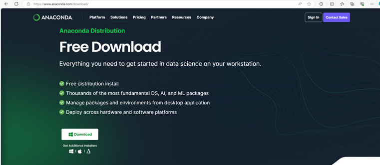

    

Open jouw "Bestandsverkenner" / "file explorer" links onderaan:
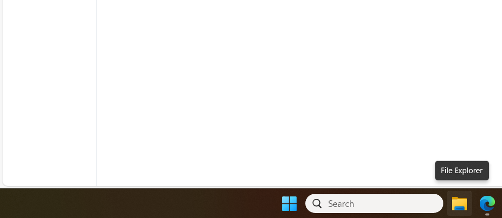

    

Zoek vervolgens de gedownloade set-up in kwestie die in jouw "Downloads" folder zit en dubbelklik op het bestand om de toepassingen toe te voegen aan je computer.

    

Volg de instructies die Anaconda geeft en verander de standaardaanbevelingen niet, de standaardinstellingen zijn voorlopig goed.

          

## Hoofdstuk 3 basis: Download Visual studio code:

### Visual studio code download: https://code.visualstudio.com/download

 

Klik op de download van het besturingssysteem van je laptop, zoals Windows.

    

Open jouw "Bestandsverkenner" / "file explorer" links onderaan:

    

Zoek vervolgens de gedownloade set-up in kwestie die in jouw "Downloads" folder zit en dubbelklik op het bestand om de toepassingen toe te voegen aan je computer.

    

Volg de instructies die Visual studio code geeft en verander de standaardaanbevelingen niet, de standaardinstellingen zijn voorlopig goed.

          

## Hoofdstuk 4 basis: Een Omgeving/Environment maken:

  

Selecteer eerst het tabblad "Omgeving" / "Environment" en klik linksonder op "Maak" / "Create".

    

Vink aan "Python" als dat nog niet het geval is en geef de Omgeving/Environment een passende naam. Als je klaar bent, klik je rechtsonder op "Maak" / "Create".

          

## Hoofdstuk 5 basis: De benodigde plug-ins downloaden:

  

Voor Visual Studio code installeer je de "Python" en "Jupyter" plug-ins.

Je vind ze linksboven door op het pictogram van de vier vierkantjes te klikken en de naam van de plug-in op te zoeken. Je hoeft alleen de hoofdplug-in te installeren, de rest wordt standaard geïnstalleerd.

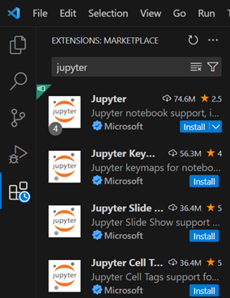

    

Op de "Thuis"/"Home" van "Anaconda's Navigator" applicatie download je de volgende plug-ins: "Jupyter Notebook", "Jupyter Lab" en "QT Console".

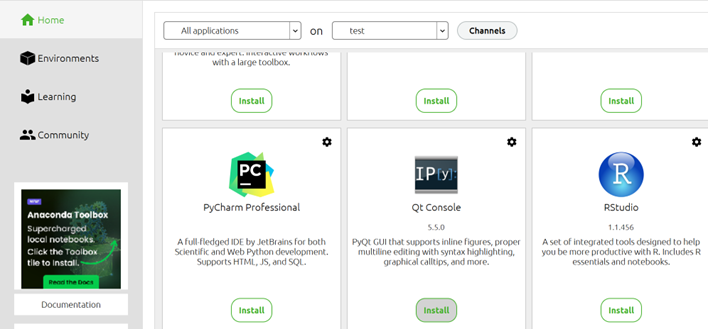

          

## Hoofdstuk 6 basis: Een Jupyter-notebookbestand maken in Visual studio code:

&nbsp;

Ga naar "Bestand" / "File" en klik op "Nieuw bestand" / "New file".

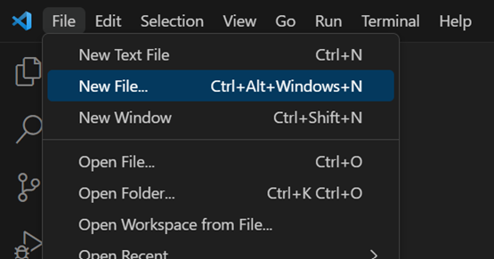

    

Dit opent een prompt Selecteer "Jupyter Notebook".

    

Als je je bestand/file wilt opslaan, doe je het volgende: 

ga naar "Bestand" / "File" > "Opslaan als" / "Save as" > voer een naam in en geef bestandslocatie naar keuze.

Als je opslaat moet het bestandstype .ipynb zijn, de computer hoort dit voor je doen als je alles na de punt weg laat.

          

## Hoofdstuk 7 basis: Aansluiten:

  

gebruik de toetsen: ctrl > shift > P in Visual studio code typ dan "Python: Selecteer Tolk" / "Python: Select Interperter":

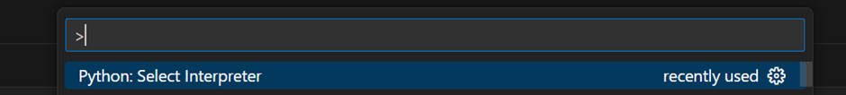

    

Selecteer in de nieuwe prompt de Omgeving/environment die je eerder hebt gemaakt.

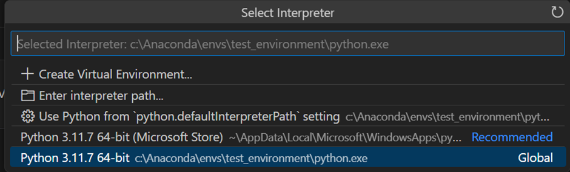

    

Gebruik de toetsen: ctrl > shift > P in Visual studio code typ dan "Terminal: Selecteer Standaard Profiel" / "Terminal: Select Default Profile"

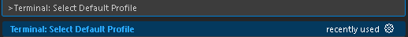

    

Selecteer de "Command prompt" optie.

          

## Hoofdstuk 8 basis: testen:

  

Schrijf deze code als een functionaliteitstest.

    

Je hebt een open terminal nodig om te testen of je omgeving/environment verbonden is.

Als je geen terminal open hebt staan, kun je een terminal openen door linksboven op "Terminal" te gaan staan en op "Nieuwe Terminal" / "New terminal" te klikken:

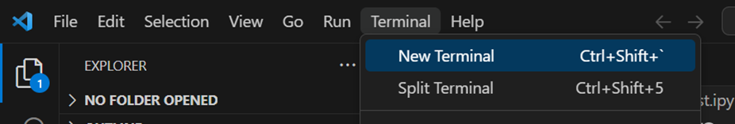

    

Nu kun je de juiste opdrachtprompt openen via de rechteronderkant door over het pijltje naast de + te gaan en op "Opdrachtprompt" / "Command prompt" te klikken.

    

Als je verbonden bent met je omgeving/environment, zie je de omgeving/environment naam links onderaan in de opdrachtprompt, gevolgd door de pathing naar de bestanden.

    

Je kan nu jouw "Command Prompt" Terminal testen door "conda" te typen en daarna enter te clicken:

    

Als je dit goed gedaan hebt leest de Terminal informatie uit over het programma van Anaconda zoals hier:

          

## hoofdstuk 9 basis: Bekende installatieproblemen en hoe deze te debuggen:

  

### Probleem 1: 

In sommige gevallen moet je Python installeren in de Microsoft store om een omgeving/environment te kunnen selecteren in Visual studio code.

    

### Probleem 2:

Soms toont de terminal je omgeving/environment niet op deze manier:

    

In dit geval moet de Kernel worden gewijzigd naar jouw omgeving/environment, om de terminal aan je omgeving/environment te koppelen.

Ga met de muis over "selecteer kernel" / "select kernel" en klik op "Selecteer een andere kernel..." / "select Another Kernel...".

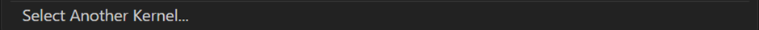

    

Selecteer "Python-omgevingen" / "Python-environments".

    

Selecteer nu jouw omgeving.

          

## Hoofdstuk 10 geavanceerd: Hoe kan je Powershell gebruiken als Terminal

  

Vind de "Scripts" folder in de "anaconda3" folder het zou de zelfde pad / path moeten hebben, het doorkruisde deel is de "user" die jij gebruikt.

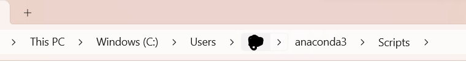

    

Klik nu rechtermuisknop op de "Scripts" folder naam van het vorige plaatje, en selecteer "Kopieer Address als tekst" / Copy Address as text.

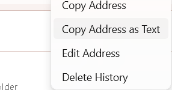

    

Hou eerst je vinger op de Windows knop, vervolgens druk op de R knop zonder los te laten van de Windows knop.

Als het goed is zie je nu dit scherm links onderaan:

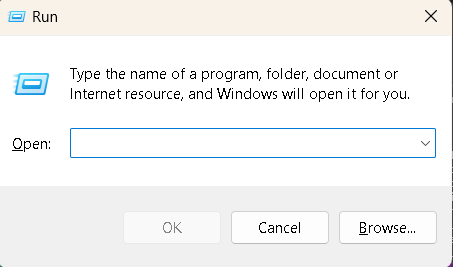

    

Typ in de prompt het volgende "sysdm.cpl" en klik op Oke links onderaan de prompt.

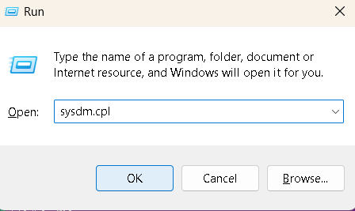

    

Een nieuwe prompt opened selecteer bovenaan "Geavanceerd" / "Advanced" en click onderaan "Omgeving Variabelen" / "Environment Variables"

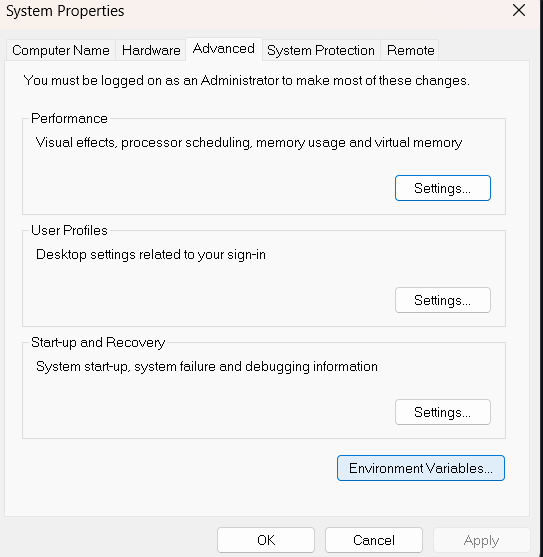

    

Selecteer bij de "Systeem Variabelen" / "System Variables" de "Pad" / "Path" 

Selecteer vervolgens "Edit..." / "Bewerken..." rechts onderaan.

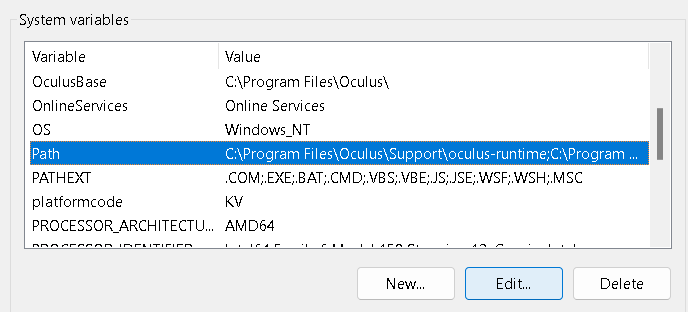

    

Selecteer in de nieuw prompt "Nieuw" / "New" 

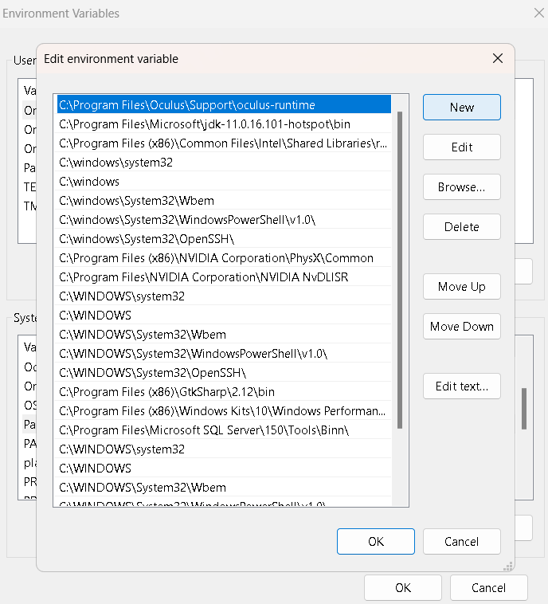

    

Druk nu de knoppen:  ctrl > V  om het "Pad" / "Path" van eerder daar neer te plakken.

    

Klik nu op de "oke" rechts onder.

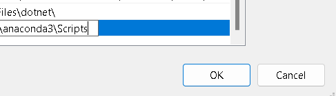

    

Doe het zelfde met de "oke" op de "Omgeving Variabelen" / "Environment Variables" van eerder.

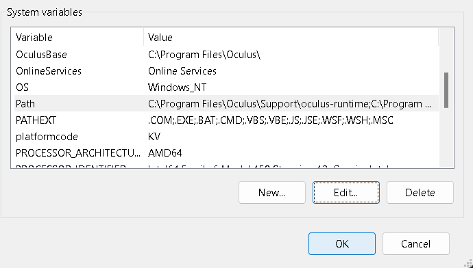

    

En de op de "oke" van "Systeem Eigenschappen" / "System properties" van eerder.

    

Zoek op "Windows Powershell" in de search bar links onder op je computer.

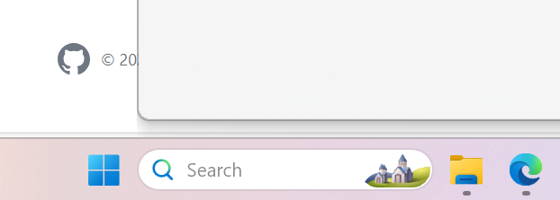

    

Klik nu rechtermuisknop op de "Windows Powershell" en selecteer "Uitvoeren als administrator" / "Run as administrator"

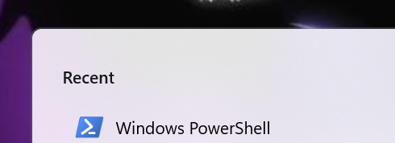

    

Schrijf in de Windows Powershell prompt "Set-ExecutionPolicy RemoteSigned" en klik "Enter" op je toetsenbord.

    

Nu vraagt het of je deze verandering wilt maken typ Hoofdletter "Y" en druk "Enter" op je toetsen board om veder te gaan.

    

Je kan nu de prompt sluiten door op het kruisje te klikken.

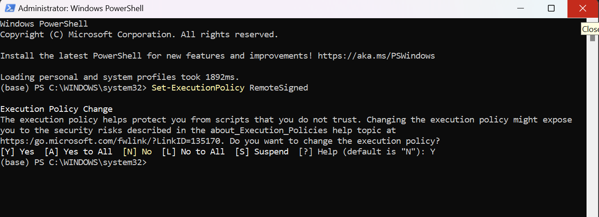

    

sluit je Visual Studio Code af, druk rechtermuisknop op de Visual Studio Code icoon en selecteer "Sluit venster" / "Close window" 

    

Ga naar de search bar links onder en typ "visual studio code" en dubble klik het icoon boven aan van Visual Studio Code 

    

